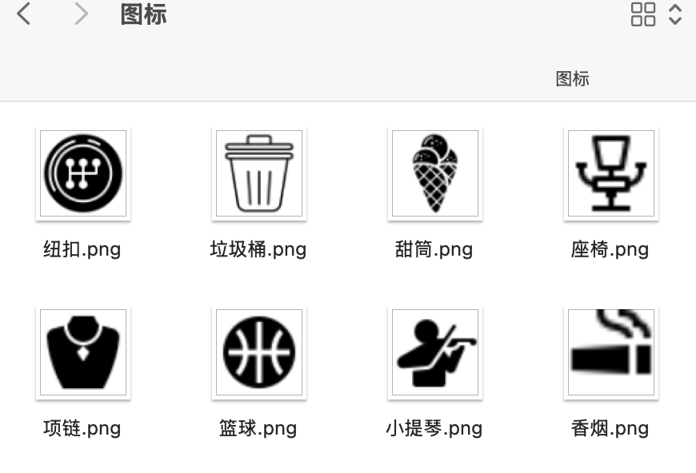
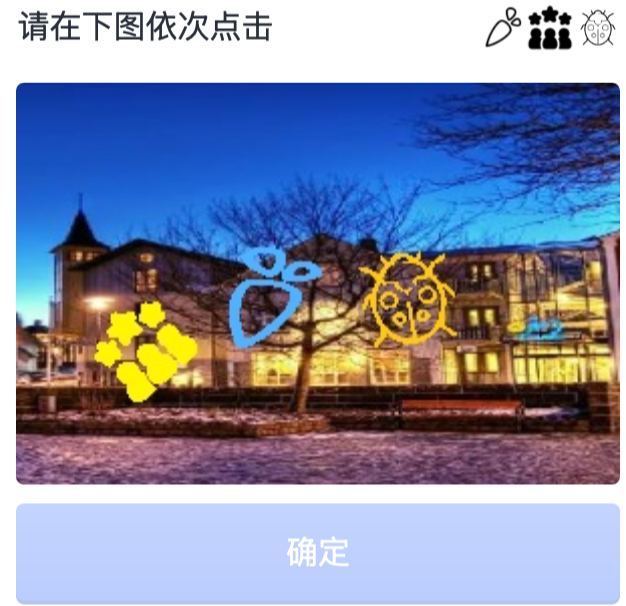

## 通用图标点选验证码识别方案

现在碰到图标点选验证码的方式，一般通过使用labelimg的方式进行打标，这种方式费时又费力。

现在有一个比较通用的方式。首先获取验证码的图标种类，去重之后与自己的数据集整合。在这过程中可以直接记录位置与种类，并转成yolo的格式。这样可以直接通过yolo的方式直接训练，而且数据集的大小完全可以自己定义。

### 效果展示

#### 自定义数据集

#### 标签数据

### yolo识别
数据集我使用了10000张左右训练。大概200个epoch，mPA50-95在94左右。使用的是YOLOv12。

### 使用方式
参考 `main.py`的使用方式。
最终数据集会保存在`save_path`里，已经分好images和labels。训练集和测试集的话可以修改`save_path`，分两次运行。这样最终效果可以直接在Yolo里训练。

### 结论
像类似下面这些验证码都可以使用以上方式进行，主要在于图标去重部分，图标解决了后续就简单了。

# 最后
代码部分仅供参考，其它类型也有其对应的方案。

仅提供思路，不提供任何解决办法。代码问题请自行参考修改。

如果对你有用的话，点个star支持一下。

如有侵权，请联系我～

转载请声明来源！！！
